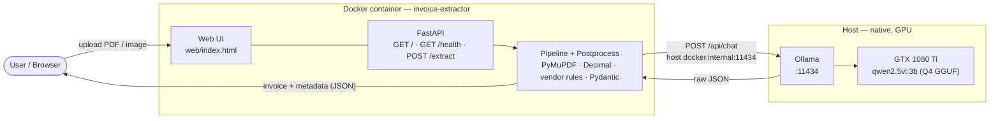
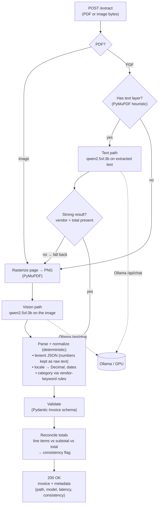

# Architecture

A local, self-hosted **receipt / invoice → schema-validated JSON** service. A
browser UI (or any HTTP client) uploads a document; a FastAPI backend routes it
through a hybrid text/vision pipeline, deterministically post-processes the model's
output, and returns a validated `Invoice` plus metadata. All inference runs locally
via **Ollama** — documents never leave the machine.

## Components & deployment

The backend runs in a container; **Ollama runs natively on the host** so it can use
the GPU (Docker can't reach the host GPU on Windows/macOS). The container reaches it
over HTTP via `host.docker.internal`.

## Request flow (`POST /extract`)

The pipeline is **hybrid**: a digital PDF with a text layer takes the cheap text
path; scans and images take the vision path; a weak text result falls back to
vision. Whatever the path, the model's output is treated as untrusted — numbers and
dates are re-parsed deterministically and totals are re-checked.

## Key design principles

- **Hybrid routing** — cheap text path for digital PDFs; vision path for scans/photos;
  automatic fallback when the text result is weak. (`app/pipeline.py`)
- **Never trust the model** — the prompt asks it to copy values verbatim; all number
  formatting (locale `1.250.000,00` → `Decimal`), date parsing, and arithmetic happen
  in deterministic Python, and totals are reconciled into a `consistency` flag.
  (`app/postprocess.py`)
- **Schema is the single source of truth** — the JSON schema injected into the prompt
  is generated from the Pydantic `Invoice` model, so prompt and validator can't drift.
  Every response is validated; absent fields are `null`, never fabricated. (`app/schema.py`)
- **Category is a rule, not the LLM** — spending category is assigned by a
  deterministic vendor-keyword map (overriding the model), which is far more reliable
  for known chains than asking a small model. (`app/postprocess.py`)
- **Local & GPU-native** — inference is Ollama on the host GPU; the container is just
  the app. Quantized GGUF models only (Q4), sized to fit modest VRAM.
